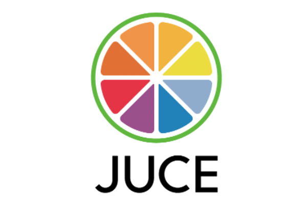

# JUCE

\*\*\*\*

_JUCE is a professional C++ framework designed primarily for audio application and plug-in development.  The JUCE Framework is widely used by both independent developers as well as companies such as Google, Apple, Akai, Waves, Korg and many more.  One of the primary benefits of using JUCE is cross-platform development, meaning a developer can deploy one code base across Windows, Mac, iOS, and Android platforms._

_**You can download JUCE**_ [_**here**_](https://emea01.safelinks.protection.outlook.com/?url=https%3A%2F%2Fshop.juce.com%2Fget-juce&data=02%7C01%7CDominika.Dronska%40abbeyroad.com%7C00c83dac1031413cc82608d63fe6f90c%7Cbbcb6b2f8c7c4e2486e46c36fed00b78%7C1%7C0%7C636766658590511358&sdata=jIPxnSNt2oCbMiZCbUlH2d8zBWPM55VDQS8wa7CBqW4%3D&reserved=0)_**, and we offer free licenses for personal and educational purposes. Once you've supplied some basic information \(such as your email\), you'll be able to download and use JUCE right away.**_

## **API MENTOR: Joshua Hodge** [**joshua.hodge@roli.com**](mailto:joshua.hodge@roli.com)\*\*\*\*

