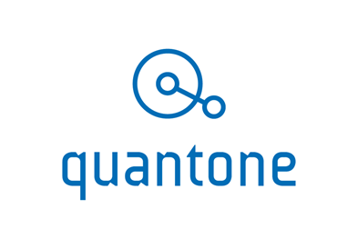

# Quantone

Quantone is the home of music metadata. Our deep and highly-linked database enables powerful search features, where you can browse from record labels to locations, recordings to musical work, and albums to session musicians. We made our data easily accessible through a Rest API, ready to use in C\#.

**Data fields**

The breadth of data captured in our database includes:

●     1,5 million artists, each with aliases and spelling in multiple languages

●     10,000 bespoke artist biographies

●     1,2 million albums

●     13 million recordings

●     12 million musical works

●     150,000 labels

●     230,000 recording and production locations

The full list of data fields and API endpoints are listed in the link below.

[https://developer.quantonemusic.com/object-documentation](https://developer.quantonemusic.com/object-documentation)

**API documentation**

You can find the full documentation on our API in the link below.

[https://developer.quantonemusic.com/rest-api-v3](https://developer.quantonemusic.com/rest-api-v3)

We’ve also included examples of data output for albums and recordings.

●     [Recording sample: Sam Smith - Stay With Me](https://developer.quantonemusic.com/recording-sample)

●     [Album sample: Sam Smith - In The Lonely Hour](https://developer.quantonemusic.com/album-sample)

**Calling the API**

Our API is stateless, which means you need to identify yourself with each call.

On each call to the API you will need an AppID and AppKey included in your HTTP request header. We have provided Abbey Road Red Hackaton 2018 participants with the following credentials:

●      AppID = 3d82c010

●      AppKey = 4581d1b6b8b14e6fc370cc0293df3116

You can call the API using [https://data.quantonemusic.com/v3](https://data.quantonemusic.com/v3)

The HTTP Request Header should look something like this:

<table>
  <thead>
    <tr>
      <th style="text-align:left">
        
GET /v3/albums?title=rumours HTTP/1.1

        
Host: data.quantonemusic.com

        
Connection: keep-alive

        
User-Agent: Mozilla/5.0 (Windows NT 6.1; WOW64) AppleWebKit/535.11 (KHTML,
          like Gecko) Chrome/17.0.963.83 Safari/535.11

        
Accept: text/html,application/xhtml+xml,application/xml;q=0.9,*/*;q=0.8

        
Accept-Encoding: gzip,deflate,sdch

        
Accept-Language: en-GB,en-US;q=0.8,en;q=0.6

        
Accept-Charset: ISO-8859-1,utf-8;q=0.7,*;q=0.3

        
<b>AppID: 3d82c010</b>
        

        
<b>AppKey: 4581d1b6b8b14e6fc370cc0293df3116</b>
        

      </th>
    </tr>
  </thead>
  <tbody></tbody>
</table>If you are accessing the Rest API via your web browser, a variety of plugins are available for each browser which allow you to specify HTTP Request Header information:

●     Chrome - [ModHeader](https://chrome.google.com/webstore/detail/modheader/idgpnmonknjnojddfkpgkljpfnnfcklj)

●     Firefox - [Modify Headers](https://addons.mozilla.org/en-US/firefox/addon/modify-headers/)

●     Safari - [Fiddler](https://www.telerik.com/fiddler)

●     Internet Explorer - [Fiddler](https://www.telerik.com/fiddler)

**Sample queries**

When running these queries you can also modify your browser header to view the results in JSON or XML.

●         **The Black Panther Soundtrack** participant credits

[https://data.quantonemusic.com/v3/albums?id=e012d284-f008-42d8-979e-d9f82455394a&depth=participations](https://data.quantonemusic.com/v3/albums?id=e012d284-f008-42d8-979e-d9f82455394a&depth=participations)

●         **Artists related to** **Miles Davis**, including his contemporaries, influences, and those he influenced

[https://data.quantonemusic.com/v3/artists?id=cf92ca73-969f-11e8-82d3-ac9e17ecfb36&depth=relatedartists](https://data.quantonemusic.com/v3/artists?id=cf92ca73-969f-11e8-82d3-ac9e17ecfb36&depth=relatedartists)

●         Ensembles with **‘symphony orchestra’** in their name

[https://data.quantonemusic.com/v3/artists?name=symphony%orchestra](about:blank)

●         **Artists** born in **Atlanta**

[https://data.quantonemusic.com/v3/artists?placeBornName=Atlanta](https://data.quantonemusic.com/v3/artists?placeBornName=Atlanta)

●         All instances of the song **‘Never Gonna Give You Up’**

[https://data.quantonemusic.com/v3/recordings?title=never%gonna%give%you%up](about:blank)

**SDK**

The SDK documentation is available in the following link:

●     [C\#](https://developer.quantonemusic.com/csharp-sdk)

**API mentors**

●     [arya.rinaldo@quantonemusic.com](mailto:arya.rinaldo@quantonemusic.com)

●     [james.willmoth@quantonemusic.com](mailto:james.willmoth@quantonemusic.com)

